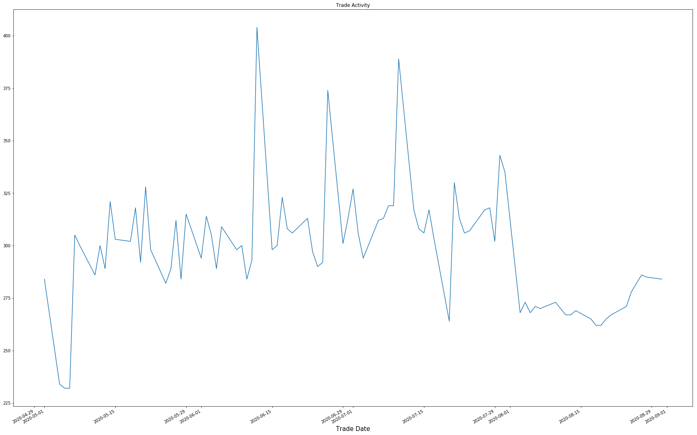
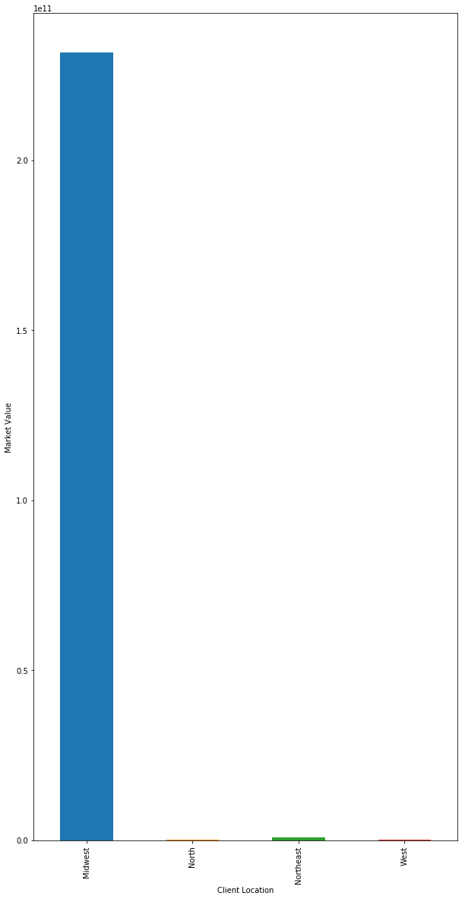
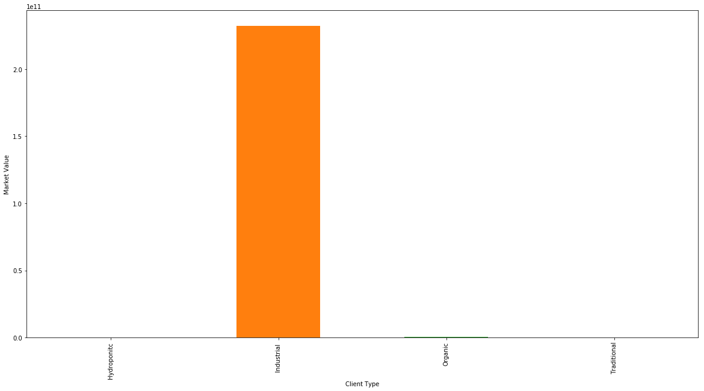
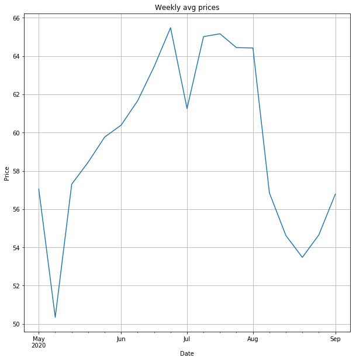
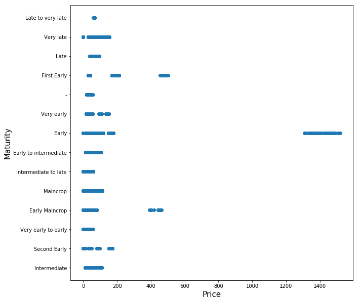
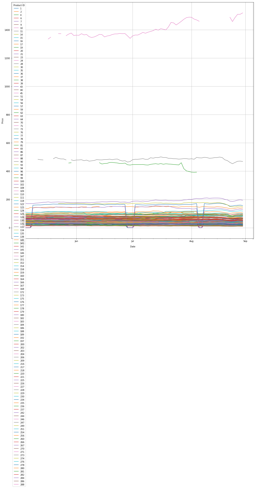

```python
import pandas as pd
import numpy as np
import matplotlib.pyplot as plt
import seaborn as sns
%matplotlib inline

"""
Problem 1 from Morgan Stanley Case Study
Requires Python (Jupyter Notebook)
Rondell King
"""
###
### LOAD AND SANITIZE DATA###
###

# Load xls sheets into dataframes
data_file = '2_Data_Files.xlsx'  # File must be in the same directory as this script

# Each sheet will be stored in the dict as a dataframe object
df_dict = pd.read_excel(data_file, sheetname=['Potatoes_Info', 'Client_Info', 'Potatoes_Positions'])
positions = df_dict.get('Potatoes_Positions')  # Trade data from 5/1/2020 to 8/31/2020. Key = Client ID
client_info = df_dict.get('Client_Info')  # Key = Client ID
potato_info = df_dict.get('Potatoes_Info')  # Ket = Product ID

#213 prices are missing in the positions, Replace them with 0
positions.isnull().sum()
positions['Price'].fillna(0,inplace=True)


# Sanitize the Data by replacing [NULL] with 0 (A value of [NULL] represents no position)
positions['Quantity'].replace('[NULL]', 0, inplace=True)

#positions['Price'] = pd.to_numeric(positions['Price'],downcast='float')
# Merge the sheets into one dataframe object, this makes reporting results a bit easier.
positions_merged = positions.merge(client_info, on='Client ID')
positions_merged = positions_merged.merge(potato_info, on='Product ID')

```

    /anaconda3/lib/python3.7/site-packages/pandas/io/excel.py:329: FutureWarning: The `sheetname` keyword is deprecated, use `sheet_name` instead
      **kwds)


```python
# Clients with the largest stock pile are shown in this sorted table.
""" Top 3 Clients in terms of market value are:
Destiny
Jamel  
Samuel
"""

# Add new column for Market value => Price * Quantity. 
positions_merged['Market Value'] = positions_merged.Price * positions_merged.Quantity
positions_merged['Market Value'].fillna(0,inplace=True)

# Aggregate on client ID to find the clients with highest market value.
top_market_value = positions_merged.groupby(['Client ID',
                                             'First Name ',
                                              'Last Name'], as_index=False)['Market Value'].sum()
top_market_value = top_market_value[['Client ID','First Name ','Last Name', 'Market Value']].sort_values(by='Market Value',
                                                                      ascending=False)

print(top_market_value.to_string(formatters={'Market Value':'${:,.2f}'.format}))
```

        Client ID First Name     Last Name        Market Value
    4          27     Destiny     Aldridge $227,333,258,486.22
    7          38       Jamel       Caruso   $4,099,865,425.30
    21         82      Samuel       Cheney     $381,338,437.50
    18         74     Nakisha  Southerland     $253,565,363.06
    5          30     Eulalia       Culver     $178,615,864.61
    22         89     Tammera     Lassiter      $77,000,752.74
    9          44      Jeremy         Kong      $68,287,532.35
    13         50      Landon         Kyle      $47,785,223.01
    23         94      Valeri   Burchfield      $47,421,539.53
    0          17        Chan          Vue      $38,883,442.46
    12         49     Kirstin       Browne      $34,918,354.53
    14         52      Larita     Albright      $27,403,986.45
    16         64      Mariko        Giles      $20,889,961.86
    19         77    Rasheeda       Spivey      $16,789,133.46
    20         78     Rashida      Proctor       $6,808,320.95
    2          21       Chase        Woody       $1,765,570.00
    3          24       Daine    Gustafson       $1,068,943.80
    15         59     Loraine    Mcdermott         $995,961.26
    6          33   Georgiana         Moya         $432,154.95
    17         65       Maura      Jeffrey         $359,841.62
    8          41       Jeane      Peoples         $336,669.20
    10         45      Kazuko      Steward         $105,272.75
    11         47       Kiera       Staton               $0.00
    1          18   Chantelle      Hollins               $0.00


```python
# Count how many times the client name is in the positions data. Get a count of unique values for First Name
# We could use any identifier from the Client Info table, that seems reasonable

"""
Jamel        10239
Nakisha       3575
Landon        2091
Valeri        1729
Mariko        1636
Jeremy        1629
Destiny       1202
Chan           961
Tammera        879
Eulalia        740
"""

positions_merged['First Name '].value_counts()
```


    Jamel        10239
    Nakisha       3575
    Landon        2091
    Valeri        1729
    Mariko        1636
    Jeremy        1629
    Destiny       1202
    Chan           961
    Tammera        879
    Eulalia        740
    Larita         327
    Samuel         185
    Kirstin        120
    Rashida        114
    Kazuko          90
    Loraine         86
    Maura           80
    Chase           75
    Rasheeda        44
    Daine           37
    Chantelle       25
    Jeane            8
    Georgiana        6
    Kiera            1
    Name: First Name , dtype: int64


```python
# Count how many times each potato is traded. Get a count of unique values
# We could use any identifier from the Potatoes Info table, that seems reasonable
"""
Argos             724
Lorimer           682
British Queen     615
Edzell Blue       611
Amorosa           582
Arran Banner      548
Shepody           514
Emma              511
Anya              482
Ambassador        480
Rocket            474
"""
positions_merged['Variety Name'].value_counts()
```


    Argos             724
    Lorimer           682
    British Queen     615
    Edzell Blue       611
    Amorosa           582
    Arran Banner      548
    Shepody           514
    Emma              511
    Anya              482
    Ambassador        480
    Rocket            474
    Accord            471
    Atlantic          461
    Carnaval          422
    Erntestolz        404
    Colleen           401
    Emblem            384
    Pentland Dell     383
    Apache            382
    Jubilee           377
    Gourmandine       372
    Barna             358
    Pentland Crown    354
    Shannon           343
    Cultra            339
    Ariata            333
    Roscor            319
    Arrow             317
    Desiree           308
    Pizazz            305
                     ... 
    Kestrel            64
    Emily              62
    Fontane            61
    Juliette           60
    Camel              56
    Cosmos             55
    Savanna            54
    Reiver             52
    Gabriel            52
    Carlingford        51
    Habibi             51
    Avondale           51
    Courage            47
    Mozart             47
    Ramos              46
    Nectar             46
    Imagine            46
    Karlena            46
    Isle Of Jura       43
    Corolle            38
    Malin              34
    Olympus            34
    Electra            33
    Arran Pilot        33
    Radebe             29
    Home Guard         25
    Shelford           23
    Alouette           13
    Slaney             12
    Arran Comet         9
    Name: Variety Name, Length: 147, dtype: int64


```python
"""
What client activity trends do you see?

Client activity is the lowest during May and peaks in June. 
In August client activity is relatively low when compared to Jun and July but there is much less volatility 
in terms number of transactions during August.

Highest trade activity count:404 occurs on 2020-06-12 
Lowest trade activity count:232 occurs on 2020-05-05
"""

# Max and min trade activity
max_trds = positions_merged['Date'].value_counts().max()
min_trds = positions_merged['Date'].value_counts().min()
max_date = positions_merged['Date'].value_counts().idxmax()
min_date = positions_merged['Date'].value_counts().idxmin()

print("Highest trade activity count:{} occurs on {}".format(max_trds, max_date))
print("Lowest trade activity count:{} occurs on {}".format(min_trds, min_date))
positions_merged['Date'].value_counts().plot(figsize=(30,20),title = 'Trade Activity')
plt.xlabel('Trade Date', fontsize=15)

client_activity_table = positions_merged.set_index('Date')
```

    Highest trade activity count:404 occurs on 2020-06-12 00:00:00
    Lowest trade activity count:232 occurs on 2020-05-05 00:00:00





```python
""" 
We see majority of the market value is controlled by those located in the Midwest.
The next largest is the Northeast but is pale in comparison,
"""
region_sum = positions_merged.groupby('Client Location')['Market Value'].sum()
print(region_sum.apply(lambda x: '{0:.2f}'.format(x)))


region_sum.plot(kind='bar',figsize=(10,20))
plt.ylabel('Market Value')
```

    Client Location
    Midwest      231650623218.59
    North           127527663.01
    Northeast       764053837.21
    West             95691518.80
    Name: Market Value, dtype: object


    Text(0, 0.5, 'Market Value')





```python
""" Majortiy of the market share is controlled by clients in the Industrial field """
industry_sum = positions_merged.groupby('Client Type')['Market Value'].sum()
print(industry_sum.apply(lambda x: '{0:.2f}'.format(x)))
industry_sum.plot(kind='bar', figsize=(20,10))
plt.ylabel('Market Value')
```

    Client Type
    Hydroponitc        54930213.16
    Industrial     232056014860.38
    Organic           441874498.27
    Traditional        85076665.81
    Name: Market Value, dtype: object


    Text(0, 0.5, 'Market Value')





```python
#What potato price trends do you see?
"""
Generally speaking you can use seasonality to help predict potato prices as it seems, there are times,
when the price increases drastically for the entire market (Jun/July) and it drops significantly in May.
"""
# Add a millisecond to each date to create a unique index. This allows us to turn the pricing data into a Timeseries
positions_merged['Date'] = positions_merged['Date'] + \
                            pd.to_timedelta(positions_merged.groupby('Date').cumcount(), unit='ms')
price_trends = positions.set_index('Date') # Overall market for poato trading

# Compute summary statistics
max_price = price_trends.Price.max()
min_price = price_trends.Price.min()
max_date = price_trends.Price.idxmax()
min_date = price_trends.Price.idxmin()

print("Max Price of {} occurs on {}".format(max_price, max_date))
print("Min Price of {} occurs on {}".format(min_price, min_date))

# Daily data is hard to draw a conlucsion on, weekly gives a better picture of the price movements for all potatoes.
weekly = price_trends['Price'].resample('W').mean()
weekly.plot(grid = True, figsize=(10,10),title='Weekly avg prices')
plt.ylabel("Price")

```

    Max Price of 1519.7 occurs on 2020-08-31 00:00:00
    Min Price of 0.0 occurs on 2020-05-04 00:00:00


    Text(0, 0.5, 'Price')





```python
#Are there any factors that can help predict potato prices?
"""
Yes it appears that the maturity of the potato can help predict the potato price.
Potato prices have some of the highest prices, where the  maturiy is shorter.
Longer maturites tend to have a stable price.

We can further build on this by categorzing the maturities and computing the corrleation between the price.
Because of time constratints I will leave the excercise for future enhancements
"""
potato_prices = positions.merge(potato_info, on='Product ID')
plt.figure(figsize = (10,10))
plt.xlabel('Price', fontsize=15)
plt.ylabel('Maturity', fontsize=15)
plt.scatter(potato_prices['Price'], potato_prices['Maturity'])
sns.despine
```


    <function seaborn.utils.despine(fig=None, ax=None, top=True, right=True, left=False, bottom=False, offset=None, trim=False)>





```python
#Are there any factors that can help predict client activity? 
"""
 A good indicator for client activity is their region, with a dominant portion of traders coming from clients in the 
 midwest.

 Another indicator for trading activity is the the industry where there is strong correlation between Industrial 
 clients and trading activity.
 
 Another indicator is the potato maturity
"""
positions_merged.groupby(['Maturity'])['Date'].count()

```


    Maturity
    -                         790
    Early                    4032
    Early Maincrop           2628
    Early to intermediate    1968
    First Early              1283
    Intermediate             4217
    Intermediate to late     2751
    Late                     1043
    Late to very late          51
    Maincrop                 2569
    Second Early             1180
    Very early               1720
    Very early to early       941
    Very late                 706
    Name: Date, dtype: int64


```python
# Summarize what has happened during th? 
"""
During this period the activity and prices are their lowest in May and peak in June.
Summer months appear to be where the highest activity and prices occur for this product type.

The fact that activity and pricing is consistent is intitutive. One would reason, that as market interest
increases for a particular product, the price will be driven higher.

Potato prices movements are generally in line with each other, following similar trends.

Client market control is heavily favored by clients coming from the Industrial sector in the Midwest region.
"""
pivoted = pd.pivot_table(price_trends, values='Price', columns='Product ID', index='Date')
pivoted.idxmax(1).to_frame().T

pivoted.plot(grid = True, figsize=(20,20))
plt.ylabel("Price")
#print(pivoted.corr())
```


    Text(0, 0.5, 'Price')




